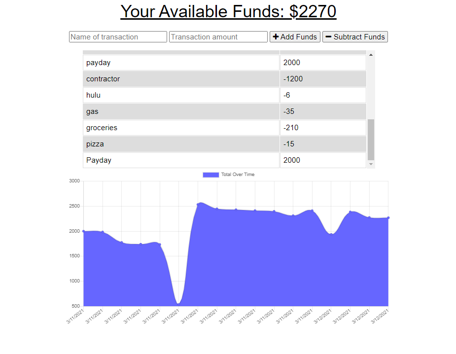
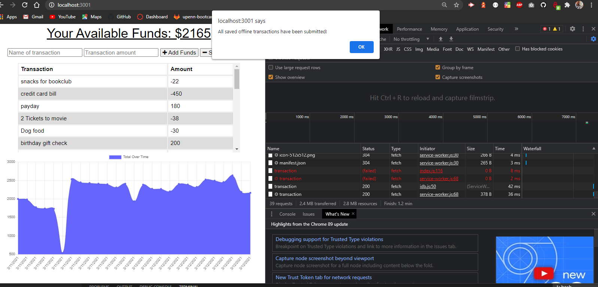

# Budget Tracker   

## Description

 

Budget Tracker is a full stack PWA(Progressive Web Application).  You can keep track of your budget no matter what your connection constraints may be.  As soon as you reestablish an internet connection Budget Tracker will automatically upload all of your input to the database.  Happy Tracking!

 

## Acceptance Criteria

 

- GIVEN a budget tracker without an internet connection
- WHEN the user inputs an expense or deposit
- THEN they will receive a notification that they have added an expense or deposit
- WHEN the user reestablishes an internet connection
- THEN the deposits or expenses added while they were offline are added to their transaction history and their totals are updated

 

## **Table of Contents**

 

* *[Installation](#installation)*
* *[Screenshots](#screenshots)*
* *[Usage Instructions](#usage-instructions)*
* *[Contributing](#contributing)*
* *[Technology](#technology)*
* *[Tests](#tests)*
* *[Questions](#questions)*
* *[License](#license)*

 

## **Installation**

 

After cloning/forking the applications use the command `npm i` or `npm install` to download the necessary dependencies.

 

## **Screenshots**

 

**Budget Tracker:**

 

**Budget Tracker confirming upload of offline input:**

 

## **Usage-instructions**

 

To test this application, or to run it locally use the command `npm start` to activate the server.  You may now navigate to `localhost:3001`.   

 

## **Contributing**

 

Please refer to the **[Contributor Covenant](https://www.contributor-covenant.org/)** for contribution guidelines.

 

## **Technology**

 

**This project was completed using:** 

  

- `Node.js`
- `Express`
- `IndexedDB`
- `MongoDB`
- `Mongoose`
- `Compression`
- `Morgan`
- `Heroku`

 

## **Tests**  

 

No test need to be run at this time. 

 

## **Questions**

 

For any questions, comments, or feedback please feel free to reach out:  
- **[Github](https://github.com/gintstir)** 
- **<gint.stirbys@gmail.com>**

 

## **License** 

 

Copyright © **Gintautas Stirbys**, **2021**.  All Rights Reserved.

This Project is licensed under the **[Apache~2.0](https://www.apache.org/licenses/LICENSE-2.0)** license.

